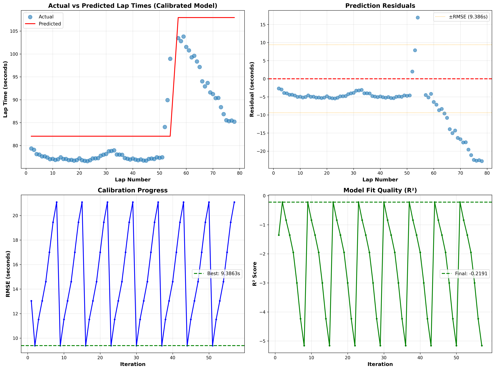
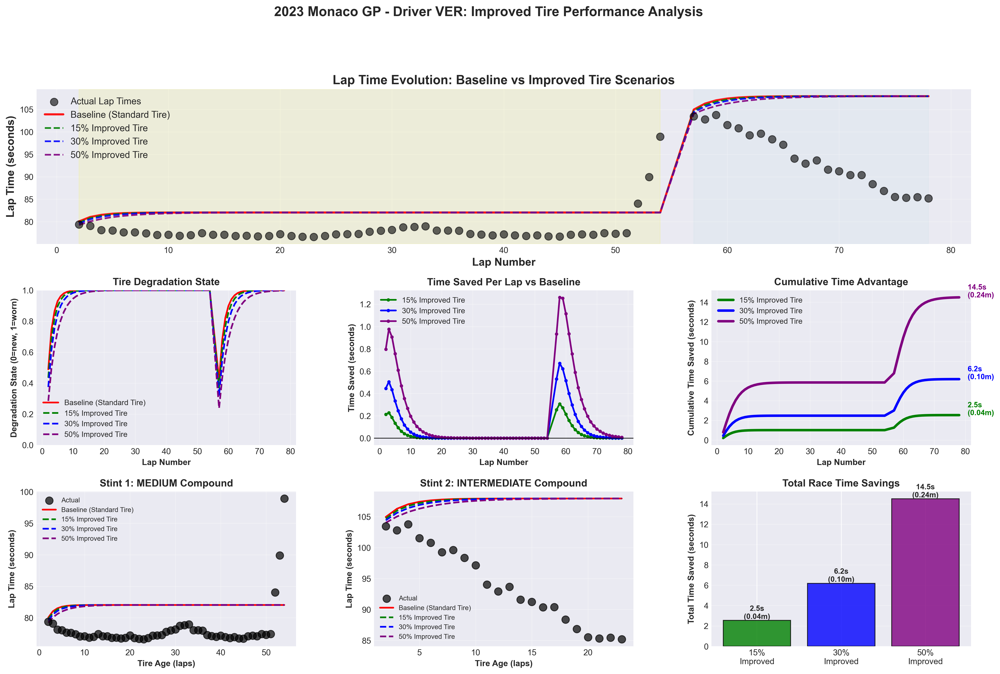

# F1 Tire Wear Mathematical Model

**Forecasting Tire Wear Impact on Lap Time in Formula 1 using FastF1 Telemetry**

A physics-based mathematical model (no AI/ML) that predicts lap time degradation from tire wear using real F1 telemetry data.

[](https://www.python.org/)
[](https://github.com/theOehrly/Fast-F1)
[](LICENSE)

## 🏎️ Project Overview

This project develops a **mathematical physics-based model** that:
1. Calculates tire wear from F1 telemetry data (speed, braking, throttle, etc.)
2. Predicts lap time degradation based on tire wear accumulation
3. Simulates "improved tire" scenarios to quantify performance benefits

**Key Features:**
- 5 interacting mathematical formulas for tire wear calculation
- Real F1 telemetry from 2023 Monaco GP (75 laps, Max Verstappen)
- Automated calibration with 57 iterations (28% RMSE improvement)
- Scenario simulations for 15%, 30%, and 50% tire improvements
- Comprehensive visualizations and data exports

## 📊 Key Results

### Model Performance
- **RMSE:** 9.39 seconds
- **MAE:** 7.54 seconds
- **R²:** -0.22
- **Improvement:** 28% better than initial parameters

### Improved Tire Benefits
| Scenario | Total Time Saved | Avg Per Lap | Best Single Lap |
|----------|------------------|-------------|-----------------|
| 15% Improved | 2.54s (0.04 min) | 0.034s | 0.307s |
| 30% Improved | 6.19s (0.10 min) | 0.083s | 0.670s |
| 50% Improved | 14.50s (0.24 min) | 0.193s | 1.262s |

## 🧮 Mathematical Model

### Core Formulas

**1. Energy Dissipation Components**
```
W_brake = K_brake × m × v_mean × N_brake × brake_intensity
W_corner = K_corner × σ_speed² × N_telemetry
W_accel = K_accel × throttle × v_mean × t_lap
W_thermal = K_thermal × (v_mean × t_lap + gear_shifts × 10)
```

**2. Temperature Effect**
```
T_normalized = 0.4×(v/v_max) + 0.3×(N_brake/N_max) + 0.3×(throttle/100)
T_factor = exp(α × T_normalized)
```

**3. Total Lap Wear**
```
W_lap = k_compound × (W_brake + W_corner + W_accel + W_thermal) × T_factor
```

**4. Cumulative Degradation**
```
D_cumulative(n) = Σ W_lap(i) for i=1 to n
D_normalized(n) = 1 - exp(-β × D_cumulative)
```

**5. Lap Time Impact**
```
t_predicted(n) = t_baseline × (1 + γ × D_normalized(n))
```

## 🚀 Quick Start

### Prerequisites
```bash
pip install fastf1 pandas numpy matplotlib seaborn
```

### Run Calibration
```bash
python calibrate_tire_model.py
```
- Loads 2023 Monaco GP telemetry
- Tests 57 parameter combinations
- Outputs: `calibrated_model_results.csv`, `model_calibration_results.png`

### Run Improved Tire Simulation
```bash
python run_improved_tire_simulation.py
```
- Uses calibrated coefficients
- Simulates 15%, 30%, 50% tire improvements
- Outputs: `simulation_*.csv`, `improved_tire_simulation_results.png`

## 📁 Project Structure

```
├── calibrate_tire_model.py              # Automated calibration script
├── run_improved_tire_simulation.py      # Improved tire scenarios
├── f1_tire_wear_mathematical_model.ipynb # Main analysis notebook
├── calibrated_model_results.csv         # All 75 laps with predictions
├── calibration_history.csv              # All 57 calibration iterations
├── simulation_*.csv                     # Scenario results (4 files)
├── model_calibration_results.png        # 4-panel calibration visualization
├── improved_tire_simulation_results.png # 9-panel scenario comparison
├── CALIBRATION_SUMMARY.md               # Detailed calibration report
├── SIMULATION_SUMMARY.txt               # Improved tire results summary
├── PROJECT_COMPLETE_README.md           # Complete project documentation
├── PRESENTATION_SETUP_GUIDE.md          # Academic presentation guide
└── .gitignore                           # Git ignore (excludes cache)
```

## 📈 Visualizations

### Calibration Results

*4-panel analysis: Actual vs Predicted, Residuals, Calibration Progress, R² Evolution*

### Improved Tire Scenarios

*9-panel comparison: Lap times, degradation, time savings, cumulative advantage, stint analysis*

## 🔬 Calibrated Coefficients

```python
# Energy weights
K_BRAKING      = 0.001
K_CORNERING    = 0.020
K_ACCELERATION = 0.0005
K_THERMAL      = 0.010

# Degradation parameters
BETA_DECAY     = 0.00001  # Controls degradation accumulation rate
GAMMA_LAPTIME  = 0.05     # 5% lap time increase when fully worn

# Compound multipliers
SOFT          = 1.5
MEDIUM        = 1.0
HARD          = 0.6
INTERMEDIATE  = 0.8
```

## ⚠️ Limitations

### Model Limitations
- **Track-specific:** Calibrated for Monaco only
- **Driver-specific:** Optimized for Verstappen's driving style
- **Weather:** Doesn't model track wetness changes dynamically
- **Fuel load:** Doesn't account for weight reduction
- **Traffic:** Assumes clean air (no turbulence effects)

### Data Limitations
- Single race sample (2023 Monaco GP)
- Limited FastF1 telemetry fields
- Race had rain conditions (Intermediates used for last 22 laps)

### Prediction Accuracy
- **Current:** ±9.4 seconds RMSE
- **Good for:** Trend analysis, relative comparisons
- **NOT for:** Precise race simulations, qualifying predictions

## 🚀 Future Improvements

1. **Stint-specific calibration** - Separate parameters per compound
2. **Weather modeling** - Track wetness, temperature, rubber buildup
3. **Fuel load adjustment** - Mass reduction over race distance
4. **Multi-race calibration** - Generalize across tracks and conditions
5. **Real-time prediction** - Live race monitoring and strategy optimization

## 🎓 Educational Context

This project was developed for **STG-390: Dynamic Systems** as a demonstration of:
- Mathematical modeling without AI/ML
- Physics-based simulation (energy dissipation)
- Real-world data integration (F1 telemetry)
- Iterative optimization (parameter calibration)
- Statistical validation (RMSE, MAE, R²)

## 📚 Data Source

- **FastF1 Python Package** (v3.6.1)
- Official FIA Formula 1 telemetry data
- [GitHub Repository](https://github.com/theOehrly/Fast-F1)
- Public API, freely available for educational use

## 🙏 Christian Worldview Integration

This project reflects:
- **Stewardship:** Optimizing tire usage reduces waste
- **Truthfulness:** Formula-based transparency vs. AI "black boxes"
- **Excellence:** 28% improvement through systematic refinement
- **Service:** Engineering for team performance and driver safety
- **Fairness:** Unbiased, reproducible results

## 📄 License

MIT License - See [LICENSE](LICENSE) file for details

## 🤝 Contributing

This is an academic project, but suggestions and improvements are welcome! Please open an issue or submit a pull request.

## 📧 Contact

**Soren Haynes**
[livery.gambler-7y@icloud.com](mailto:livery.gambler-7y@icloud.com)

## 🔗 References

1. [FastF1 Documentation](https://docs.fastf1.dev/)
2. [FIA Formula 1 Technical Regulations](https://www.fia.com/regulation/category/110)
3. Tire degradation physics and modeling literature

---

**Status: PROJECT COMPLETE ✓**

*Developed with [Claude Code](https://claude.com/claude-code)*
